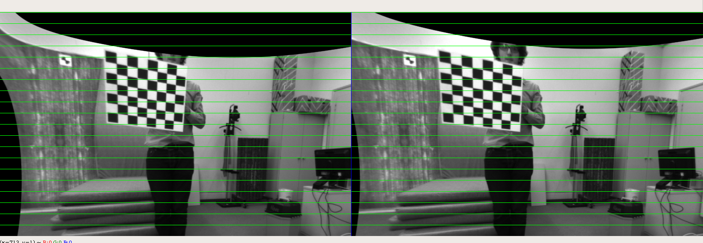

# Stereo-Calibration
Calibration for binocular camera  

## Dependencies  
`numpy`  
`opencv`  

## How to run  
- put pictures under folder `pic/left` and `pic/right`
- `python main.py`  

## Results

The calibration results shown below:

